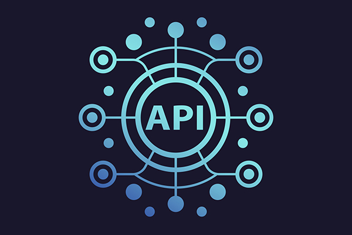

# <div align="center"> <p align="center"> Generic API: The All-Purpose Solution for Your API Needs </p></div>

This GitHub repo contains code for a generic API in Python using the FastAPI framework. Includes examples for HTTP requests, auth, data validation, error handling, and has a config file for easy setup. Also includes example usage with a sample client app.

## Prerequisites
Before running the code in this repository, you must create a ```.env``` file containing the necessary environment variables to run the framework and place it in the root of the repository, as explained [here](docs/env_file/env-file-description.md).

Additionally, you must have KeyCloak, Postgres, MongoDB and a FastAPI Workspace installed and configured using Docker Compose.

### KeyCloak, MongoDB and FastAPI Installation using Docker Compose
1. Make sure you have Docker and Docker Compose installed on your system. If not, you can download Docker from the official website (https://www.docker.com/get-started) and follow the instructions for your operating system to install it. If you install the Docker Desktop, Docker Compose may be installed automatically. You can also install Docker Compose by following the instructions on this link (https://docs.docker.com/compose/install/)
2. Use the existing ```docker-compose.yml``` file in the root of the repo, you can find the file here: [docker-compose.yml](docker-compose.yaml)
3. Run KeyCloak and MongoDB containers by running the following command in the root directory of the repository where the ```docker-compose.yml``` file is located:

```
docker-compose up -d
```

4. Configure Keycloak by following the steps outlined in the [Keycloak Configuration Steps](docs/keycloak-configuration.md)

Once you have completed these steps, you should be able to run the code in this repository. 

Please note that the code in this repository is just an example and you will need to adapt it to your own needs.
Please also note that, if you want to run keycloak on different ports or use different environment variables, you can change them accordingly in the `docker-compose.yml` file.

### Viewing the Execution Results
Once you have completed the installation steps outlined above and run the command `docker-compose up -d`, the API, MongoDB, and Keycloak will be running on your localhost at the ports specified in the `.env` file. To access these services, you can simply open a web browser and enter the URL of the localhost along with the appropriate port number.

For example, if the API is running on port `8000`, you can access it by entering the URL `http://localhost:8000` in your web browser. Similarly, if MongoDB is running on port `27017`, you can access it by entering `http://localhost:27017`.

You can also view the logs of the running services by running `docker-compose logs -f` command in the root directory of the repository where the `docker-compose.yml` file is located. This will display the logs of all the services in real time.

Additionally, you can check the status of the services by running `docker-compose ps`. This command will show you the current status of all the services running in the compose file.

In order to stop the services, `run docker-compose down` command in the root directory of the repository where the `docker-compose.yml` file is located.

Please note that the ports and URLs used in the examples above are based on the default settings in the `docker-compose.yml` file and `.env` file. If you have configured different ports or URLs, you will need to use those instead.

To create a development environment and be able to test or modify the code, you must follow the instructions in [Creating a Development Environment](docs/environment-for-development.md). Once the environment is created, you will be able to run the code and make changes as needed. It is important to remember that any changes you make must be properly tested before they are deployed to production.

## Creating New Users and Records

In order to create new users and records with the API, you can use a POST request with a JSON or YAML file.

* [Here](docs/yaml_file/user_yaml_file.md) is the information on how to create YAML files for creating users.
* [Here](docs/yaml_file/user_yaml_file.md) is the information on how to create YAML files for creating a record_two.

## Building Your Own API from this Repository Code

If you are interested in using the code from this repository to build your own API, you can follow the instructions in the dedicated chapter [Building Your Own API](./docs/building_your_own_api.md). This section will guide you through the process of setting up the code and customizing it to meet your specific needs. With this information, you will be able to create a fully functional API that can serve as the backbone for your next project.
