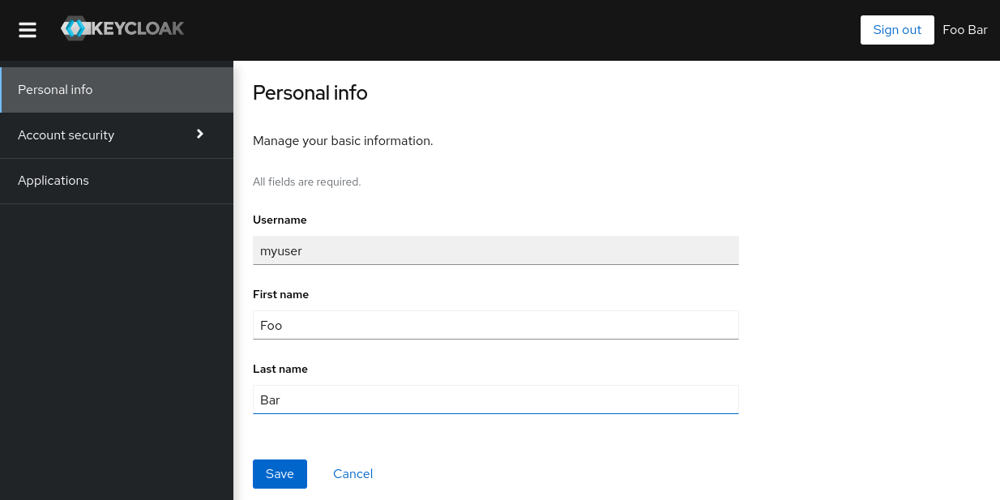

# KeyCloak configuration

Keycloak is an open source identity and access management solution for modern applications and services. It is a single sign-on and identity provider platform that provides secure access to applications, APIs, and services.

Here, we will show you how to configure Keycloak in a basic way so you can use it with your framework. We'll go over the basics of setting up Keycloak and how to use it for authentication and authorization. By the end of this tutorial, you'll have the basics of Keycloak up and running and ready to use with your Generic API framework.

*Note: This tutorial was created based on the official [get started](https://www.keycloak.org/getting-started/getting-started-docker) tutorial of Keycloak.*

## Create a new realm in Keycloak

In Keycloak, a realm is comparable to a tenant. It allows for the creation of segregated collections of applications and users. By default, there is a single realm known as "master" in Keycloak. This is devoted to administering Keycloak and should not be used for your own applications.

1. Go to the `Keycloak Admin Console` (http://localhost:8080/admin, change the port `8080` if needed). Access the interface with the administrator credentials (by default **user**: admin, **password**: admin).
2. Put your cursor over the dropdown at the top-left of the page, where it says master, then select `Create realm`.

<div align="center"></div>

3. Fill in the form with the following details:
    
    **Realm name**: myrealm

4. Press `Create`.

## Create a user

Initially there are no users in a new realm, so let’s create one:

1. Open the `Keycloak Admin Console`
2. Click `Users` (left-hand menu)
3. Click ```Create new user``` (top-right corner of table)
4. Fill in the form with the following values:

    **Username**: myuser

    **First Name**: Your first name

    **Last Name**: Your last name

<div align="center"></div>

5. Click Create

The user will need an initial password set to be able to login. To do this:

1. Click `Credentials` (top of the page)
2. Fill in the `Set password` form with a password

<div align="center"></div>

## Login to account console

Let’s now try to login to the account console to verify the user is configured correctly.

1. Open the `Keycloak Account Console`
2. Login with `myuser` and the password you created earlier

You should now be logged-in to the account console where users can manage their accounts.

<div align="center"></div>

## Set up the client

Let’s try to secure our Generic API. First step is to register the Generic API with your Keycloak instance:

1. Open the `Keycloak Admin Console`
2. Click `Clients`
3. Click `Create client`
4. Fill in the form with the following values:

    **Client type**: OpenID Connect

    **Client ID**: myclient

<div align="center"></div>

5. Click `Next`
6. Make sure `Standard flow` is enabled
7. Click `Save`

After the client is created you need to update the following values for the client (add the local url where the API will be deployed):

**Valid redirect URIs**: http://localhost:5000/*

<div align="center"></div>

Remember to click `Save`.

## Create a 'secret' for the client admin_cli from the REALM 'master' and 'myrealm'

Knowing the 'secret' of the admin_cli client is crucial for administering the Keycloak server and managing users. This secret, along with the admin username and password, is required to authenticate as an administrator and perform actions such as creating or deleting users. It is important to keep this secret secure and not share it with unauthorized parties.

In order to use the admin_cli client, the secret must be added to the KEYCLOAK_ADMIN_SECRET and KEYCLOAK_REALM_SECRET environment variable in the .env file of your application. This will allow your application to authenticate as the admin_cli client and perform the necessary actions on the Keycloak server. Without this secret, your application will not have the necessary permissions to manage users or perform other administrative tasks.

To retrieve the secret for the admin_cli client, follow these steps:

1. Open the `Keycloak Admin Console` by navigating to the URL http://localhost:8080/admin (change the port as needed).
2. Log in with the admin username and password.
3. Click on the Realm dropdown at the top-left of the page and select `Master`.
4. Click on Clients in the left-hand menu.
5. Click on the admin_cli client.
6. On the `Settings` tab, scroll down to the `Configure capability` section and turn on the switch for `Client Authentication`
7. Click on Save button to save the changes. Now you will see the Credentials tab appearing.
8. Click on the Credentials tab.
9. Copy the client secret and paste it in the environment variable from the .env file called KEYCLOAK_ADMIN_SECRET.
10. Proceed to perform the pre-steps using the `myrealm` Realm and copying the `secret` value into the `KEYCLOAK_REALM_SECRET` variable in the .env file.

<div align="center"></div>
